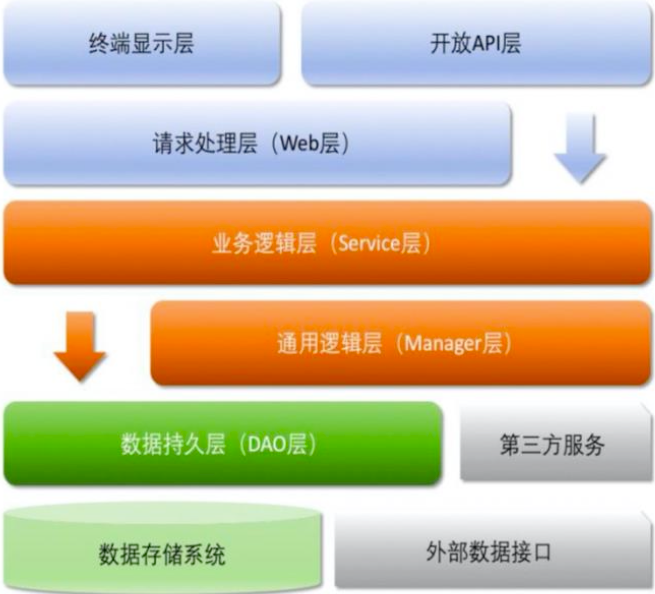

根据业务架构实践，结合业界分层规范与流行技术框架分析，推荐分层结构如图所示，默认上层依赖于下层，箭头关系表示可直接依赖，如:开放
API 层可以依赖于 Web 层(Controller 层)，也可以 直接依赖于 Service 层，依此类推:

# 分层说明

- 开放 API 层(layer-demo-api-xxx): 可直接封装 Service 接口暴露成 RPC 接口;通过 Web 封装成 http 接口;网关控制层等。
- Web 层(layer-demo-web): 主要是对访问控制进行转发，各类基本参数校验，或者不复用的业务简单处理等
- Service 层(layer-demo-service): 相对具体的业务逻辑服务层。
- Manager 层(layer-demo-core): 通用业务处理层，它有如下特征：
    - 对第三方平台封装的层，预处理返回结果及转化异常信息，适配上层接口。
    - 对 Service 层通用能力的下沉，如缓存方案、中间件通用处理。
    - 与 DAO 层交互，对多个 DAO 的组合复用。
- DAO 层(layer-demo-core): 数据访问层，与底层 MySQL、Oracle、Hbase、OceanBase 等进行数据交互。
    - 在 DAO 层，产生的异常类型有很多，无法用细粒度的异常进行 catch， 使用 catch(Exception e) 方式，并 throw new
      DAOException(e)，不需要打印日志，因为日志在 Manager 或 Service 层一定需要捕获并打印到日志文件中去，如果同台服务器再打日志，浪费性能和存
      储。在 Service 层出现异常时，必须记录出错日志到磁盘，尽可能带上参数和上下文信息，相当于保护案 发现场。Manager 层与
      Service 同机部署，日志方式与 DAO 层处理一致，如果是单独部署，则采用与 Service 一致的处理方式。Web
      层绝不应该继续往上抛异常，因为已经处于顶层，如果意识到这个异常 将导致页面无法正常渲染，那么就应该直接跳转到友好错误页面，尽量加上友好的错误提示信息。开放
      接口层要将异常处理成错误码和错误信息方式返回。
- 第三方服务(layer-demo-core): 包括其它部门 RPC 服务接口，基础平台，其它公司的 HTTP 接口，如淘宝开放平台、支付宝付款服务、
  高德地图服务等。
- 外部数据接口(layer-demo-core): 外部(应用)数据存储服务提供的接口，多见于数据迁移场景中。

# 领域模型说明

- DO(Data Object): 此对象与数据库表结构一一对应，通过 DAO 层向上传输数据源对象。
- DTO(Data Transfer Object): 数据传输对象，Service 或 Manager 向外传输的对象。
- BO(Business Object): 业务对象，可以由 Service 层输出的封装业务逻辑的对象。
- Query: 数据查询对象，各层接收上层的查询请求。注意超过 2 个参数的查询封装，禁止使用 Map 类来传输。
- VO(View Object): 显示层对象，通常是 Web 向模板渲染引擎层传输的对象。

# 当前紧急优化项

- Controller 里面不允许直接返回 DO 对象，也不允许直接使用 DO 对象请求，必须类似 Dubbo 接口，统一使用 VO 对象返回给前端。
- 抽象出 Manager 层，放在 layer-demo-core 包下，提供分层说明中的 Manager 层所描述的能力。